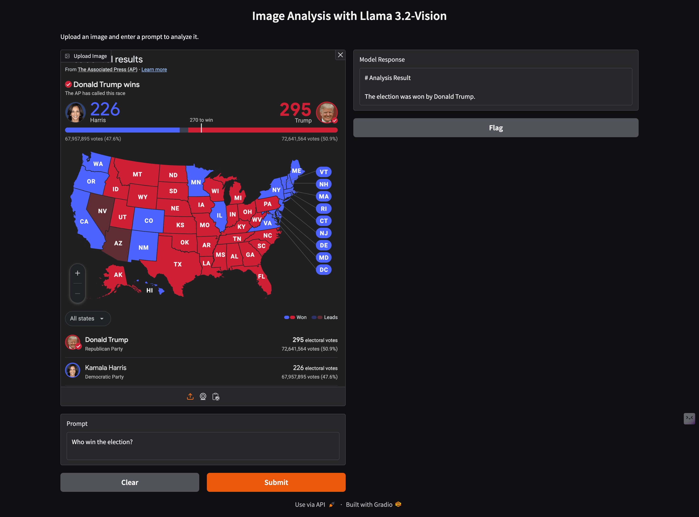

# Llama 3.2 Vision Interface

A Python application that provides a Gradio web interface for the Llama 3.2 Vision model using Ollama. This interface allows users to upload images and get AI-powered descriptions or analysis based on custom prompts.

## Features

- Web-based interface using Gradio
- Image upload functionality
- Customizable prompts for image analysis
- Integration with Llama 3.2 Vision model via Ollama
- Markdown rendering for model responses

## Screenshot



## Prerequisites

- Python 3.10 or higher
- Poetry for dependency management
- Ollama installed with Llama 3.2 Vision model

## Installation

1. Clone the repository:

```bash
git clone https://github.com/hongthana/llama32-vision.git
cd llama32-vision
```

2. Install dependencies using Poetry:

```bash
poetry install
```

## Usage

Run the application with:

```bash
poetry run python llama32-vision/app.py
```

This will launch a Gradio web interface where you can upload images and enter prompts for analysis.

## Code Overview

### Main Components

- `app.py`: Contains the main application logic, including the `analyze_image` function that processes images and prompts, and the Gradio interface setup.

### Key Functions

- `analyze_image(image, prompt)`: Converts the image to base64, sends it to the Llama 3.2 Vision model via Ollama, and returns a markdown-formatted response.

### Dependencies

The project uses the following key dependencies:

- `Pillow`: For image processing
- `ollama`: For interacting with the Llama 3.2 Vision model
- `gradio`: For creating the web interface
- `rich`: For enhanced console output

## License

This project is licensed under the MIT License.